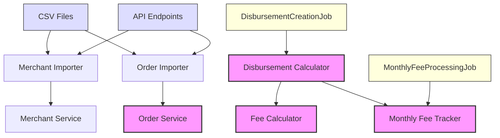
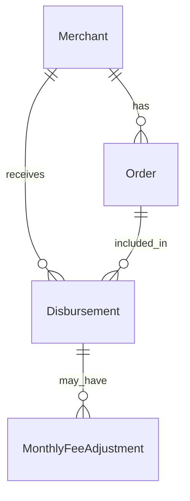

# Merchant Payments System

[](https://www.ruby-lang.org/)
[](https://rubyonrails.org/)
[](coverage/index.html)
[](LICENSE)
[](https://github.com/rubocop/rubocop)


A Ruby on Rails application that handles merchant disbursements and fee calculations for an e-commerce payment system.

## Quick Start

There are 2 possible ways of starting the project.

- 1 | Running all the scripts to import data and generate the missing disbursements and fees adjustments.
  It takes around 45 minutes

```bash
bundle install
bin/setup_all # Sets up dependencies, DB, and imports sample data
rails s # Starts the server (needed for the background jobs to work)
rails c # Starts the console
```

- 2 | Copying the development and test databases directly in the storage folder

```bash
storage
├── development.sqlite3
└── test.sqlite3
```

This way we just need to run `bundle install` to have the project running, skipping the creation & migration steps for the database.

## System Requirements

- Ruby 3.4.1
- Rails 8.0.1
- Sqlite

## Development

```bash
bundle install
rails db:setup
rspec
rubocop
```

## Business Rules

- Disbursement Frequencies: Daily/Weekly (based on merchant's live_on date)
- Processing Time: 8:00 UTC daily
- Commission Structure:
  - < 50€: 1.00%
  - 50€ - 300€: 0.95%
  - ≥ 300€: 0.85%

### Assumptions

Based on the instructions some assumptions have been made:

• The Disbursements compute orders from the previous day

• For orders created exactly at 0:00:00 we take a window time of -2 seconds

• The future merchant and order creations are handled via a simple API

## Project Structure & Architecture

This project follows Domain-Driven Design (DDD) principles while maintaining Rails conventions where appropriate.
The core business logic is organized in the `lib` directory, separated from the Rails-specific code.

## Architecture Overview



### Domain-Driven Design Implementation

This is the structure where the code is located.

```
lib/
├── domain/
│   ├── disbursements/
│   │   ├── data/
│   │   ├── entities/
│   │   ├── errors/
│   │   ├── repositories/
│   │   ├── services/
│   │   └── value_objects/
│   ├── fees/
│   │   ├── jobs/
│   │   ├── repositories/
│   │   └── services/
│   └── merchants/
│       ├── data/
│       ├── entities/
│       ├── errors/
│       ├── repositories/
│       └── services/
└── infrastructure/
│    ├── persistence/
│    │   └── active_record/
│    │       ├── concerns/
│    │       └── models/
│    └── presenters/
│        └── api/
│            └── v1/
├── tasks/
```

### Architectural Decisions

- **Domain Layer**: Contains core business logic, entities, and value objects
- **Infrastructure Layer**: Handles technical concerns like persistence and API presentation
- **Rails Convention**: Controllers and routing follow standard Rails practices
- **Separation of Concerns**: Business logic is isolated from framework code

### Trade-offs and Considerations

- **Hybrid Approach**: While following DDD principles, we maintain Rails conventions where they add value
- **Complexity Balance**: Simplified DDD implementation to meet project timeline
- **Future Extensibility**: Structure allows for easy addition of new domains/features
- **Testing Strategy**: Domain logic can be tested independently of Rails

## Data Model



## Testing Strategy

- Unit tests: Core business logic
- Integration tests: Some E2E core functionalities
- Overall test coverage: 90% (run `open coverage/index.html` for a view in your browser)

```bash
Finished in 8.12 seconds (files took 1.4 seconds to load)
439 examples, 0 failures, 6 pending

Coverage report generated for RSpec to /Users/..../merchant-payments/coverage.
Line Coverage: 89.23% (1003 / 1124)
```

Our comprehensive test suite ensures reliability across all layers:

- Domain logic tested in isolation
- API endpoints tested with real data
- Critical business flows covered end-to-end
- Money calculations thoroughly tested for precision

## Automation & Background Processing

### Scheduled Jobs

The system uses Rufus Scheduler to handle time-based operations:

```ruby
# Runs every day at 5:00 AM
scheduler.cron "0 5 * * *" do
  Domain::Disbursements::Jobs::DisbursementCreationJob.perform_later
end

# Runs at 4 AM on 1st of each month
scheduler.cron "0 4 1 * *" do
  Domain::Fees::Jobs::MonthlyFeeProcessingJob.perform_later
end
```

- **DisbursementCreationJob**: Runs daily at 5 AM to process previous day's disbursements
- **MonthlyFeeProcessingJob**: Runs monthly to calculate fee adjustments based on minimum monthly fees

These scheduled jobs ensure:

- Timely processing of merchant disbursements
- Accurate monthly fee calculations
- Automated system maintenance
- Reliable background processing

## Rake Tasks

The system provides several Rake tasks for data management and processing:

```bash
# Calculate statistics for README table
rake "stats:calculate_table_data"

# Import initial data
rake "import:merchants"
rake "import:orders"

# Process disbursements
rake "disbursements:import_without_retries"
rake "disbursements:create[2024-03-20]"  # Process specific date

# Process monthly fees
rake "monthly_fees:process[2024-03]"  # Process specific month
rake "monthly_fees:process_historical[2023]"  # Process entire year
```

### Key Tasks

- **stats:calculate_table_data**: Generates statistics for the README table
- **import:merchants/orders**: Imports initial CSV data
- **disbursements:create**: Creates disbursements for a specific date
- **disbursements:import_without_retries**: Imports historical disbursement data
- **monthly_fees:process**: Processes monthly fees for a specific month
- **monthly_fees:process_historical**: Bulk processes fees for a year

These tasks are crucial for:

- Initial data setup
- Historical data processing
- Manual interventions when needed
- Statistics generation
- Batch processing of fees and disbursements

## API Documentation

API documentation is available in [OpenAPI/Swagger format](swagger/v1/swagger.yaml)

### Endpoints

```ruby
POST /api/v1/orders # Create new order
POST /api/v1/merchants # Create new merchant
```

e.g. Curl can be used to create merchants or orders

```bash
# Merchant creation
curl -X POST http://localhost:3000/api/v1/merchants \
  -H "Content-Type: application/json" \
  -d '{
    "reference": "merchant_X",
    "email": "merchant@example.com",
    "live_on": "2024-03-20",
    "disbursement_frequency": "DAILY",
    "minimum_monthly_fee": "29.99"
  }'
{"id":"3dff6af3-c148-402e-85b7-1aeafbd5a9ab"}%
# Order creation
curl -X POST http://localhost:3000/api/v1/orders \
  -H "Content-Type: application/json" \
  -d '{
    "merchant_reference": "bins_inc",
    "amount": "61.74",
    "created_at": "2023-01-01T00:00:00Z"
  }'
```

## Statistics

| Year | Disbursements | Amount to Merchants | Order Fees    | Monthly Fees Count | Monthly Fees Amount |
| ---- | ------------- | ------------------- | ------------- | ------------------ | ------------------- |
| 2022 | 2,131         | 38,219,742.31€      | 342,228.03€   | 26                 | 464.12€             |
| 2023 | 13,365        | 189,317,609.52€     | 1,700,719.62€ | 119                | 2,057.17€           |

## Future Improvements

- [ ] API authentication and authorization (if needed)
- [ ] Refactor tests (use factories instead of POROs)
- [ ] Apply design patterns where appropriate
- [ ] Use Ruby 3.x pattern matching for declared variables
- [ ] Switch database to PostgreSQL or MySQL
- [ ] Improve test coverage
- [ ] Set up a GitHub Action for automatic testing and linting
- [ ] Define a TTL (Time-To-Live) policy to periodically delete records older than XXXX
- [ ] Implement `ON DELETE CASCADE` or soft deletions based on clear business rules
- [ ] Enhance logging (e.g., tags for each class: `"[DisbursementCreationJob] ..."`)
- [ ] Improve error handling
- [ ] Add monitoring
- [ ] Implement real-time notifications
